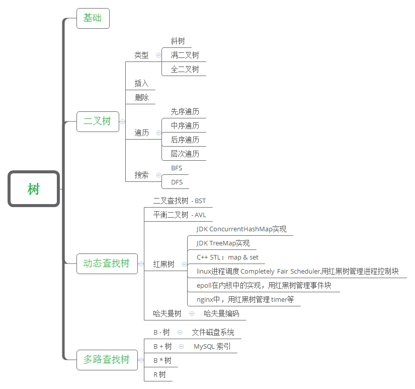
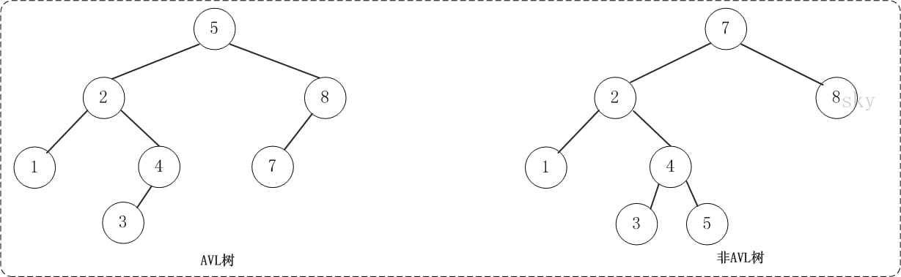

## 平衡二叉树

> 它是一棵空树或它的左右两个子树的高度差的绝对值不超过1，并且左右两个子树都是一棵平衡二叉树。

## AVL树

> AVL树是高度平衡的二叉树。它的特点是: AVL树中任何节点的两个子树的高度最大差别为1。

## 红黑树

> 红黑树是一棵二叉搜索树，它在每个节点增加了一个存储位记录节点的颜色，可以是RED,也可以是BLACK；通过任意一条从根到叶子简单路径上颜色的约束，红黑树保证最长路径不超过最短路径的二倍，因而近似平衡。

应用：TreeMap，HashMap（Java 8~)

## B 树

> B树(英语: B-tree)是一种自平衡的树，能够保持数据有序。这种数据结构能够让查找数据、顺序访问、插入数据及删除的动作，都在对数时间内完成。B树，概括来说是一种自平衡的m阶树，与自平衡二叉查找树不同，B树适用于读写相对大的数据块的存储系统，例如磁盘

## B+ 树

> B+ 树是一种树数据结构，通常用于关系型数据库(如Mysql)和操作系统的文件系统中。B+ 树的特点是能够保持数据稳定有序，其插入与修改拥有较稳定的对数时间复杂度。B+ 树元素自底向上插入，这与二叉树恰好相反。
