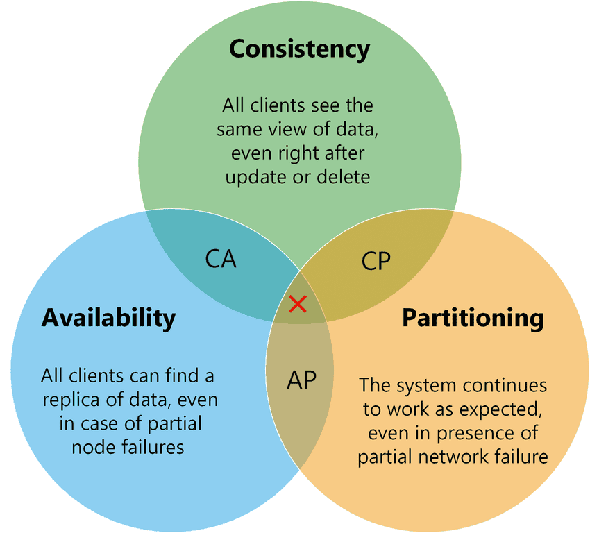

## CAP

> CAP理论是分布式系统、特别是分布式存储领域中被讨论的最多的理论。其中C代表一致性 (Consistency)，A代表可用性 (Availability)，P代表分区容错性 (Partition tolerance)。CAP理论告诉我们C、A、P三者不能同时满足，最多只能满足其中两个。

- `一致性 (Consistency)`: 一个写操作返回成功，那么之后的读请求都必须读到这个新数据；如果返回失败，那么所有读操作都不能读到这个数据。所有节点访问同一份最新的数据。
- `可用性 (Availability)`: 对数据更新具备高可用性，请求能够及时处理，不会一直等待，即使出现节点失效。
- `分区容错性 (Partition tolerance)`: 能容忍网络分区，在网络断开的情况下，被分隔的节点仍能正常对外提供服务。

## Base

> BASE是“Basically Available, Soft state, Eventually consistent(基本可用、软状态、最终一致性)”的首字母缩写。其中的软状态和最终一致性这两种技巧擅于对付存在分区的场合，并因此提高了可用性。

